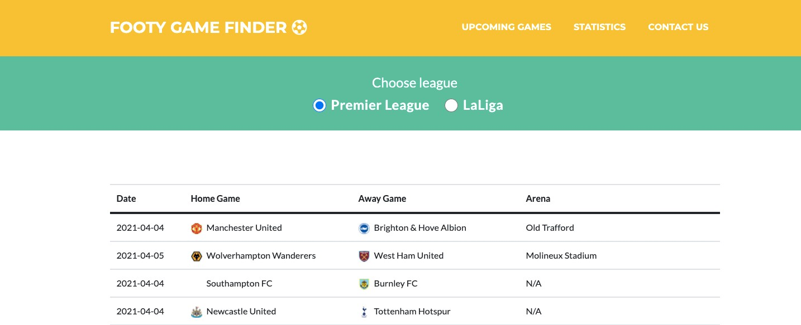

# Footy Game Finder 

>This website was made for a fictive company named **(Footy Game Finder Co)** that needed a website to show upcoming games for La Liga (Spain) and Premier League (England) during the current season. 

## La Liga and Premier League Edition

The Footy Game Finder website displays information in a table via click on "radio buttons" about upcoming top league football matches
and also more info such as date, home team and away team. The website also contains league leaderboard which display information about top scorers from the leagues. It also contains information about the Footy Game Finder Co. in the footer, 
for the the users to contact or get a clearer picture of the company background.

## Project start

My basic solution and sketch for creating project was to build a one page website with a very simple usability and that also to make it easy for all football lovers to find both La Liga and Premier League team's upcoming games, top scorers and more.
## User Experience (UX)
The idea for this project was to build a API front-end website for a fictive company that is showing the top leagues's upcoming games. 

Footy Game Finder is interested in getting more people that likes football (Spanish and English) to find upcoming games easier and also through their own website.

The audience for this website are people that are nuts about both football and to see when the next top league match will be played. 

**To be able to help the Footy Game Finder Co with their project, I had to first focus on the user needs such as:**

- As an user I would like to visit a clean one page with focus on the matches/games. 

- As an user I would like to get information about the upcoming games through an sport API.  

- As an user I would like to use buttons to switch and get the infomation about the dates, home team, away team of the sport event. 

- As an user I would like to see reults of the API in a readable and userfriendly table.  

- As an user I would like to find quick and simple contact information in the footer. 

This will be the start for buidling the website. 

>I tried to stay on the same path during the entire project with both colors and design. 

 ### Mockup/Wireframe for the Project
 Link to the Footy Game Finder made in Figma: 
>https://www.figma.com/file/TJDljGcRYszv3fAVKWk5Xb/Footy-Game-Finder-(PL-%26-La-Liga)?node-id=0%3A1

## Website Features

- **Navbar** - Just a basic and welcoming navbar with Foot Game Finders colors to make the user feel like they are in the right place and that they can get familiar with the brand and company. 

- **Radio Buttons** that allows the user to choose between the two leagues and load different data into the table. 

- An **"Upcoming Games"** section where all the about the upcoming games will be presented in a table that makes it easy to overview for the users.

- A **Leadboards"** section where the user will find a the current leadbord of top scorers, it displays in  different tables that loads automatically.

- A **Contact** form for users to get in touch with Footy Game Finder Co. 

- A **Footer** - Including some brief info about the website, contact and address.

- Resposive design sutiable for desktop, tablet and phone view. 

## Technologies used in the project
- **HTML5** 
- **CSS** 
- **[Bootstrap](https://getbootstrap.com/docs/4.5/getting-started/introduction/)** 
- **[JavaScript](https://www.javascript.com/)**
- **[API](https://sportdataapi.com/)**  I used the SportData  API to create the interactive part on the website.

- **[Gitpod](https://gitpod.com/)**
I relied on Gitpod's developer environment to write the code for my project.

- **[GitHub](https://github.com/)**
I hosted my deployed website to GitHub, with previous versions of my code stored through the commit history.

- **[Figma](https://www.figma.com/)** I used figma for creating the mockup and wireframe.

## Testing 

I have tested the Footy Game Finder website and was unable to find any error or bad links on the website. 

**Devices Used:**
-	iPhone x – iOS 11.4
-	iPad – iOS 11.2.2 & iOS 11.4.1
-	MacBook – iOS 11.4
-	PC – Windows 10

**Browsers Used:**
-	Chrome 
-	Safari
-   Mozilla 

### Navbar:

- Click on each of the links within the menu (including the website name/logo), and verify that each one is working correctly, and that they navigate the user to the correct section.

- Scroll back up and ensure the navbar appears again.

- Scroll down the website and ensure the navbar moves smoothly out of view. Click and check if the navbar is closing and opening in mobile view.

### Radio Buttons:

- Click the 'Premier League' radio button, a spinning loading wheel apperas and some seconds after the table below get loaded and filled with information about the upcoming games in premier league. 

- Click the 'La Liga' radio button and the table below, it removes the Premier League games data in the table and now shows the upcoming games in La Liga instead. 

### Upcoming Games:

- Scroll down below the radio buttons to view all upcoming games, read about the date, home team and away team and keep scrolling further to view later game dates. 

- Scroll up and click on the other option to change league. 

### Leadboards:

- Scroll down from **"Upcoming Games"** or press the navbar link named "Leaderboard" to go further down to another section that contains  league leaderbords and top scorer boards for both Premier League and La Liga.

- While on the **"Leadboard"** section view the ordered lists of team leadbords and top scorers in Premier league. 

### Footer:

- Scroll down to the bottom of the one page, where the footer is and the

### Issues/problems/improvements
No known bugs or bigger problems, however some minor things should be fixed: 

- A place for banners to make Footy Game Finder find an extra way to get income. 

- The design could always improve such as colors, logo and more. 

- Add more leagues, statistic and more functionality view options.

-  Build a login function that allows user to share news and talk about upcoming games.

- Due to lack of time/resubmission deadline, I did not find a solution in JS in time that could load data from standings into, Premier League and La Liga table on leaderbords page. 

- Due to lack of time/resubmission deadline, I did not find a quick solution for changing some of the ID names in HTML/CSS because of the Boostrap templates/theme many rules.

- A recomendation is to save data to a **local storage** or **session storage** for faster performance and unnecessary web-trafic use.  

All this would be in the 2.0 version.

### Validation HTML
The file passed validation at https://validator.w3.org/nu/#textarea

## Deployment
The process to deploy the code was following:

On GitHub, I went to the repository for the project.

Then I navigated to a button named 'Settings' for the repository.

I then scrolled down to the 'GitHub Pages' section of the settings.

I selected 'master branch' from the 'source' dropdown menu.

After that I clicked save.

Then I pushed to 'master', and the website would be updated.

My website can be found at the following URL:
> https://dannynagyai.github.io/Code-Institute-Milestone-Project-02/.

## Credits

### Content
All of the content on the website is an example/fictive. 

### Mentor
Got a lot of help from a local Software developer in Sweden named Daniel Sweder with over 20 years of programming experience . 

### Media 
All of the photos used on this site were obtained (and bought) from Shutterstock [here](https://www.shutterstock.com/sv/home)

### Acknowledgements and References
- [Code Institute](https://www.codeinstitute.net/) - I used what I learned so far from Code Instiute (HTML/CSS/Boostrap/JavaScript/API). 
- [Sport Data API](https://www.https://app.sportdataapi.com/) - I used this website to learn more about API and to use their services.
- [w3Schools](https://www.w3schools.com/js/js_api_fetch.asp) - I used this to learn more about API and JS.
- [YouTube](https://www.youtube.com/results?search_query=api) - I used this to learn more about API and to view parts of many different videos.
- [Bootstrap](https://startbootstrap.com/theme/freelancer) - I used this template to be able to shape the website.
- [Mozilla Developer](https://developer.mozilla.org/en-US/docs/Learn/JavaScript/Client-side_web_APIs/Introduction) - I used this page to learn more about API, JS and Fetch.
- [Stack Overflow](https://developer.mozilla.org/en-US/docs/Learn/JavaScript/Client-side_web_APIs/Introduction) - I used this page to learn more about API, JS and Fetch.
- 

## by DannyNagyAI
